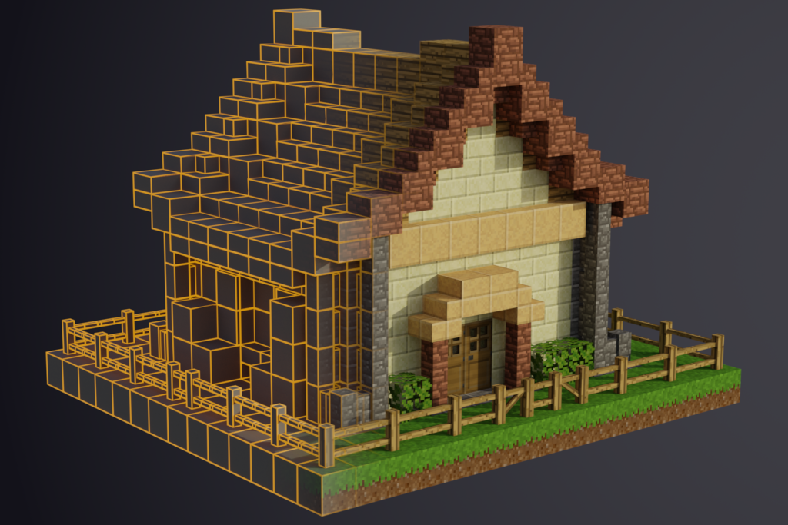

# Meshport (Luanti Mesh Exporter)

Meshport is a mod which allows easy exporting of scenes from Luanti (Minetest) to `.obj`
files, complete with materials and textures. These models can be imported
directly into Blender or another 3D program for rendering and animation.

This mod is still in the beta phase; certain texturing features and node
drawtypes are not yet supported.

## Usage

Only players with the `meshport` privilege are allowed to select areas and
export meshes. This privilege is granted to singleplayer/admin players by
default.

To export a mesh, first select the area you want to export. There are two ways
to do this:

- Use the **Meshport Area Selector** tool. Left- or right-click on a node or
  object to select either corner of the area. Hold sneak while clicking a node
  to select the node in front of the face you clicked on.
- Or, use the `/mesh1` and `/mesh2` commands to set either corner. You can
  specify a position (e.g. `/mesh1 -24 0 24`) or leave the argument blank to
  use your current position (e.g. `/mesh1`).

After selecting an area, use `/meshport [filename]` to export the mesh
(filename is optional).

The `/meshrst` command can be used to clear the current
selection.

Folders containing exported meshes, including `.obj` and `.mtl` files, are
saved in the `meshport` folder of the world directory.

### Importing into Blender

Once the model is exported, you can import the `.obj` file into Blender with
default settings. Make sure "Image Search" in the import settings is selected
to ensure textures from the `.mtl` file are imported as well.

#### Fixing materials

Upon importing the file, Blender assigns basic materials to the model which are
inaccurate and not very usable. By default, these materials appear blurry and
lack transparency. The `materials.py` script is included in the mod to fix
these issues. Open the script in Blender's text editor and run the script with
the mesh selected.

Meshport does not handle texture modifiers or node coloring, so some materials
will probably still need to be fixed by hand after running the script.

#### Other fixes

Some mesh nodes may not have any vertex normals, which can lead to lighting
problems. To fix this, what I have found to work is to select the all the
problematic nodes (either manually or by selecting by material in edit mode),
mark the selected edges as sharp, and average the normals by face area.

Some animated textures may also appear incorrect. Meshport tries to scale
texture coordinates of animated textures to fit within one frame, but some
nodes (especially flowing liquids) can exceed this boundary. If this is an
issue, switch to a non-animated texture and scale up the affected UV maps to
match the new texture.

Additional tip: Use an HDRI sky texture (such as one from [here][1]) for
awesome-looking renders. ;)

[1]: https://hdrihaven.com

## Supported features

The following node drawtypes are currently supported:

- Cubic drawtypes, including `normal`, `allfaces`, `glasslike`, and their
  variants (see below)
- `glasslike_framed`
- `liquid` and `flowingliquid`
- `nodebox`
- `mesh` (only `.obj` meshes are exported)
- `plantlike` and `plantlike_rooted`

Meshport also supports many of Luanti's relevant features, including:

- Most `paramtype2`s (note that color is ignored for colored types)
- `visual_scale`
- World-aligned textures
- Animated textures (only one frame is used)

Some special rendering features are unsupported, including texture modifiers,
overlay textures, and node coloring.

### Notes on cubic nodes

Drawtypes `allfaces_optional` and `glasslike_framed_optional` are output the
same as `allfaces` and `glasslike`, respectively.

Due to the differences between Luanti's rendering engine and 3D programs such
as Blender, it is impossible to exactly replicate how certain cubic nodes are
rendered in Luanti. Instead, Meshport aims for a compromise between accuracy
and simplicity of geometry. In certain cases where two cubic nodes are
touching, one face may be offset slightly to avoid duplicate faces while still
allowing both faces to be visible.

## License

Textures are licensed under [CC BY 4.0][2]. Everything else (including source code)
is licensed under the GNU LGPL v3.0.

[2]: https://creativecommons.org/licenses/by/4.0/
